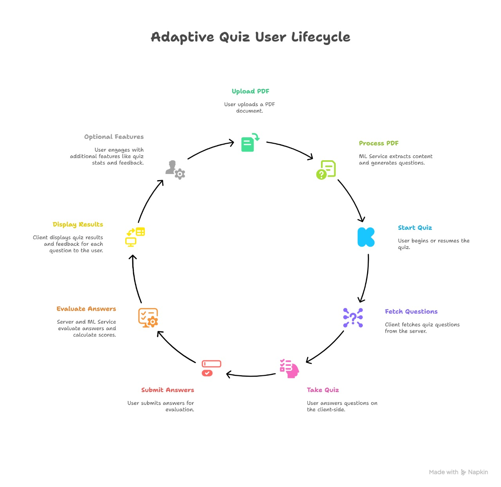
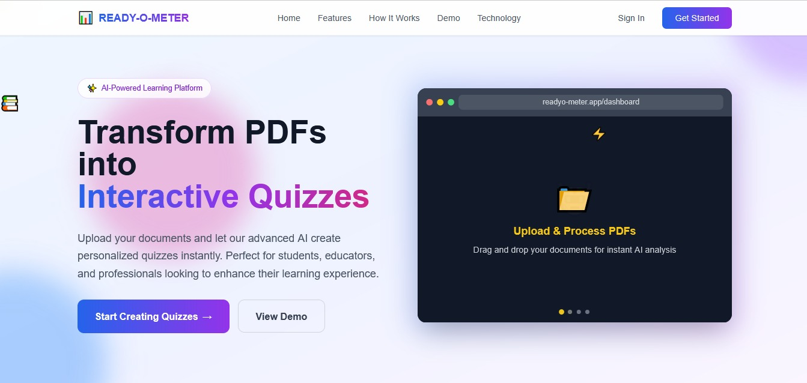
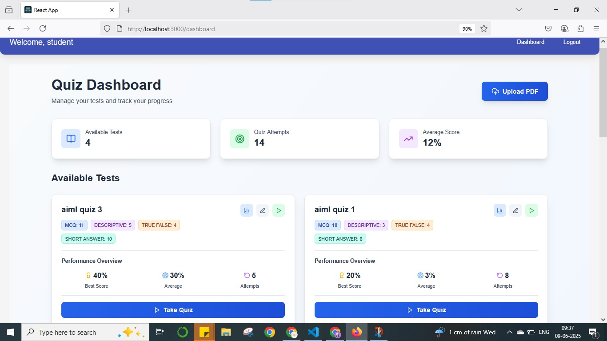
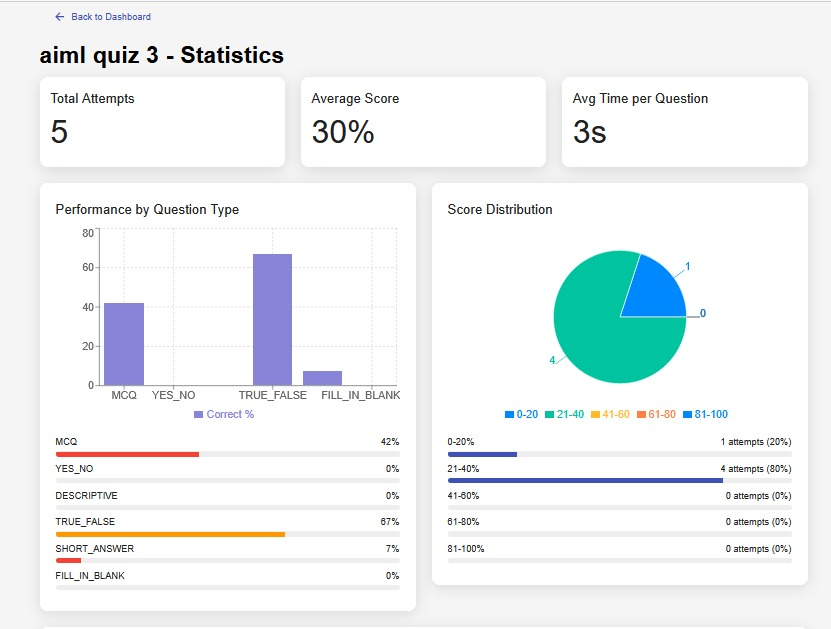

# 🎯 QuizSphere – The Adaptive Quiz Experience

> Revolutionizing learning with AI-powered adaptive quizzes that evolve in real-time.

QuizSphere is a full-stack platform that dynamically adjusts quiz difficulty based on user performance, designed for learners seeking challenge and developers valuing clean architecture.

---

## 💡 Why QuizSphere?

QuizSphere offers a smart, scalable solution for personalized learning:

- 📈 Adaptive quizzes that respond to user answers  
- 🧠 AI-driven insights using FastAPI and NLP  
- 💻 Built with React, Node.js, and MongoDB  
- 🔐 Secure JWT-based authentication  

---

## 🧩 Core Features

- Real-time adaptive quiz engine  
- ML microservice for response evaluation  
- Protected routes with JWT authentication  
- Dynamic difficulty adjustment  
- Analytics-ready for performance tracking  

---

## 🛠 Tech Stack & Architecture

| Component      | Technology                  |
|----------------|-----------------------------|
| Frontend       | React.js, Axios             |
| Backend API    | Node.js, Express            |
| ML Microservice| Python, FastAPI, spaCy, NLTK|
| Database       | MongoDB Atlas               |
| Communication  | RESTful APIs                |
| Authentication | JSON Web Tokens (JWT)       |

> The system consists of three services communicating via REST APIs, ensuring scalability and maintainability.

📌 **Architecture Diagram**  
<p align="center">
  
</p>

---

## 📸 Interface Snapshots

Explore QuizSphere in action with interactive previews:

<p align="center">
  
  
  
</p>


---

## 📂 Project Structure

```plaintext
quizsphere/
├── client/         # React frontend
├── server/         # Express backend
├── ml-service/     # FastAPI ML microservice
├── assets/         # Architecture and UI visuals (screenshots, gifs)
├── run-instructions.txt
└── README.md

```

## 🔧 Setup & Usage

Setup instructions, environment configuration, dependencies, and commands for each service are detailed in:

📄 [`run-instructions.txt`](./run-instructions.txt)

---

## 👤 About the Creator

**Lakshmi Sree Karnati**  
BTech – Artificial Intelligence and Machine Learning  
Aspiring AIML Engineer | Tech Enthusiast  

🔗 [GitHub](https://github.com/lakshmisree157/) 
🔗 [LinkedIn](https://www.linkedin.com/in/lakshmi-sree-1-ai-enthusiast/)

---

> QuizSphere demonstrates how real-time intelligence and full-stack engineering combine to make learning smarter.

Explore the code, run locally, or collaborate — all details are in the repo.
